# MCP Studio 🚀

### The Ultimate Desktop IDE, Inspector & Testing Platform for Model Context Protocol (MCP)

[-emerald.svg)]()

[🌐 Official Website](https://mcp.mtlglabs.space) • [🏢 MTLG Labs](https://mtlglabs.space) • [👨‍💻 Author Portfolio](https://mtlg.site) • [📥 Official Releases](https://github.com/alexandrmotologa/mcp-studio/releases) • [👔 LinkedIn](https://linkedin.com/in/alexandr-motologa)

 

[-6366f1?style=for-the-badge&logo=windows&logoColor=white)](https://github.com/alexandrmotologa/mcp-studio/releases/latest/download/MCP-Studio-Setup-2.1.3.exe)
[-4f46e5?style=for-the-badge&logo=windows&logoColor=white)](https://github.com/alexandrmotologa/mcp-studio/releases/latest/download/MCP-Studio-Portable-2.1.3.exe)
[-000000?style=for-the-badge&logo=apple&logoColor=white)](https://github.com/alexandrmotologa/mcp-studio/releases/latest/download/MCP-Studio-2.1.3-arm64.dmg)
[-333333?style=for-the-badge&logo=apple&logoColor=white)](https://github.com/alexandrmotologa/mcp-studio/releases/latest/download/MCP-Studio-2.1.3-x64.dmg)

[-A81D33?style=for-the-badge&logo=debian&logoColor=white)](https://github.com/alexandrmotologa/mcp-studio/releases/latest/download/MCP-Studio-2.1.3.deb)

---

## 🌟 Overview

**MCP Studio** is the flagship all-in-one developer IDE, inspector, automated testing suite, and AI agent simulation platform for the **Model Context Protocol (MCP)**. Think of it as **Postman + Swagger + Fiddler + Multi-LLM Simulation Arena** built specifically for AI agents, server architects, and tool creators.

Whether you're developing local MCP servers in **Python (FastMCP)**, **TypeScript (`@modelcontextprotocol/sdk`)**, **Go**, or **Rust** (`stdio` transport) or orchestrating production microservices over remote **HTTP/SSE**, MCP Studio delivers complete protocol visibility, real-time debugging, and automated CI/CD tooling.

---

## 🗺️ Architecture & Protocol Ecosystem

MCP Studio sits between your AI clients (Claude Desktop, Cursor, Windsurf, local LLMs) and your target servers (PostgreSQL, Filesystem, GitHub, custom APIs, Docker containers), giving you total control and observability over the protocol flow:

```mermaid
flowchart LR
    subgraph AI_Clients["AI IDEs & Clients"]
        direction TB
        Claude["Claude Desktop"]
        Cursor["Cursor IDE"]
        Windsurf["Windsurf"]
        LocalLLM["Local Ollama"]
    end

    subgraph MCP_Studio["MCP Studio Engine"]
        direction TB
        Inspector["🔍 Dynamic Tool Inspector"]
        Visualizer["📊 Multi-View Visualizer"]
        Traffic["⚡ Real-Time Traffic Bus"]
        Simulator["🤖 Multi-LLM Simulator"]
    end

    subgraph Servers["MCP Servers (Stdio & SSE)"]
        direction TB
        DB["PostgreSQL / SQLite"]
        FS["Filesystem / Local OS"]
        GH["GitHub / Git APIs"]
        Custom["Custom Microservices"]
    end

    AI_Clients -->|Model Context Protocol| MCP_Studio
    MCP_Studio <-->|Stdio / SSE Transports| Servers
```

---

## 📸 Visual Workspace Tour

### 1. Interactive Tool Inspector & Live Response Visualizer
Inspect schemas, execute tools with dynamic input forms, generate smart mock data with 1 click, and view results in JSON Tree, Smart Data Tables, or Markdown preview:

### 2. Multi-LLM AI Agent Simulator & Benchmark Arena
Test how frontier LLMs (Claude 3.7 Sonnet, GPT-4o, DeepSeek, and local Ollama) interact with your tools in real-time, view reasoning traces, and measure latency:

### 3. Live JSON-RPC Traffic Bus & Packet Inspector
Monitor incoming and outgoing JSON-RPC 2.0 frames with millisecond timestamps, request-response correlation, latency benchmarks, and replay capabilities:

### 4. Developer Power Toolkit
Built-in Schema Validator, Code Generator (Python, TS, Go, Rust), Curl Exporter, Server Scaffolder, and Security Auditing suite:

---

## 🎯 Why MCP Studio?

| Problem | Without MCP Studio | With MCP Studio |
| :--- | :--- | :--- |
| **Testing Tools** | Restart Claude or Cursor every time code changes | ⚡ 1-Click Hot-Restart directly in Studio |
| **Inspecting Traffic** | Guessing JSON-RPC payloads in terminal noise | 🔍 Packet-level traffic bus with search, filters & diff |
| **Form Inputs** | Hand-writing JSON objects for nested parameters | 🎲 Dynamic auto-generated forms with Faker auto-fill |
| **Model Verification** | Paying API credits blindly without tracing steps | 🤖 Multi-LLM Simulator & Model Arena with step tracing |
| **Response Analysis** | Parsing raw text dumps | 📊 Interactive JSON Trees & Smart Sortable Tables |
| **Client Integration** | Writing integration code from scratch | 📋 1-Click export to Python, TS, cURL, Go, Rust |

---

## 🏗️ Open Core Model

MCP Studio follows an **Open Core** architecture:

* **Community Edition (Free Tier):**
  * Full-featured MCP Client supporting **Stdio** and **Remote SSE** transports (1 active server).
  * **Dynamic Schema Form Generator:** Visual interactive execution forms from JSON Schema specifications.
  * **Smart Mock Data Auto-Filler:** 1-Click parameter generation based on Faker heuristics.
  * **Multi-View Response Visualizer:** Interactive JSON Tree, Smart Data Table, Markdown Previewer, and Base64 Media Viewer.
  * **Client Code Snippets:** Instant client execution code in Python, TypeScript, cURL, Go, and Rust.
  * **Live Process Console Drawer:** Real-time `stdout` and `stderr` logging with hot-restart capabilities.
  * **JSON-RPC Traffic Inspector:** Packet-level inspector with full search, filters, and replay.
  * **Auto-Discovery Scanner:** Auto-detect and import installed servers from Claude Desktop & Cursor.

* **Pro & Team Edition (Proprietary Upgrades):**
  * **Unlimited Multi-Server Workspaces:** Concurrently run and orchestrate up to 100+ servers simultaneously.
  * **Multi-LLM AI Agent Simulator:** Autonomous multi-turn reasoning with local Ollama, Claude 3.7 Sonnet, GPT-4o, Gemini 2.0 Flash, DeepSeek R1, Groq, and OpenRouter.
  * **AI Model Arena Shootout:** Side-by-side comparative benchmarking of two models executing identical tool prompts.
  * **15 Developer Power Tools:** Automated assertion test suites, concurrency & latency benchmarking, security sandbox auditor, in-memory mock MCP server engine, OpenAPI converter, Docker packager, remote ngrok tunnel bridge, session recorder, and workflow builder.
  * *Learn more at [https://mcp.mtlglabs.space](https://mcp.mtlglabs.space)*.

---

## ⚡️ Complete Feature Highlights (v2.1.3)

### 1. 🔍 Live Tool Inspection & Smart Mocking
* **Dynamic Form Generator:** Automatically analyzes JSON Schema property definitions into interactive input forms with field validation and `Ctrl+Enter` immediate execution.
* **🎲 Smart Mock Data Auto-Filler:** Intelligent Faker engine analyzing parameter keywords (`email`, `sql`, `uuid`, `path`, `timestamp`, `name`, `limit`, etc.) to auto-populate forms in 1 click.
* **Multi-View Response Visualizer:**
  * 🌲 **Interactive JSON Tree View:** Expandable nodes with syntax highlighting and 1-click path copying.
  * 📊 **Smart Table View:** Auto-detects arrays of objects (SQL queries, API responses) with instant search and column sorting.
  * 📝 **Markdown Previewer:** Rich formatted preview for markdown and text outputs.
  * 🖼️ **Base64 Media & File Viewer:** Visual rendering for base64 images, PDFs, and assets with 1-click download.
* **Client Code Snippets Generator:** Generates copy-pasteable client execution code in **Python (`mcp.ClientSession`)**, **TypeScript**, **cURL (JSON-RPC 2.0)**, **Go (`mcp-go`)**, and **Rust (`mcp-sdk-rs`)**.
* **Live Process Console Drawer:** Real-time terminal capturing `stdout` and `stderr` stream output from child processes with hot-restart capabilities.

### 2. 🛡️ Multi-Layer Server Limit Enforcement (New in v2.1.2)
* **Visual Locking:** Servers beyond the Community Edition limit are visibly gated with `[ 🔒 PRO ]` badges, preventing accidental multi-server oversubscription.
* **Conversion & Guidance Modal:** Helpful contextual dialog clarifying single-server development with direct options to upgrade or remove excess servers.
* **State Protection:** Guaranteed fallback ensures smooth, uninterrupted single-server workflows without UI deadlocks.
* **Process Level Isolation:** Backend IPC guards ensure strictly controlled subprocess execution.

### 3. 🚀 Luxury Guided Onboarding & Setup
* **Interactive 4-Step Welcome Guide:** Introduces newcomers to MCP concepts, server hubs, and developer superpowers.
* **Live Local Ollama Health Ping:** Instant connection detection on `127.0.0.1:11434` with guided model advice.
* **Inline API Key Vault Configuration:** Securely saves Anthropic, OpenAI, or Google AI keys on initial launch with OS-level DPAPI encryption.
* **Replay Anytime:** Re-triggerable directly from **Settings > About > Welcome Tour** or Header menu.

### 4. 🖥️ Reliable Silent One-Click Setup (NSIS) & Auto-Updates
* **Guided Fast Setup:** Installs in seconds with customizable installation paths and desktop shortcut creation.
* **Seamless Background Auto-Updater:** Automatically detects new versions from GitHub Releases and provides 1-click restart & update.
* **Smooth Squircle Branding:** Polished app icon geometry with transparent outer alpha for clean Windows taskbar & desktop appearance.

### 5. 📊 Protocol Telemetry & Analytics Dashboard
* **Real-Time Latency Percentiles:** Visual bar charts tracking live response latency (p50, p95, p99).
* **Reliability & Health Score:** Live percentage tracking error rates and failed RPC calls.
* **Token Footprint Estimator:** Estimates prompt tokens, schema overhead, and session token counts.
* **Live JSON-RPC Traffic Stream:** Real-time packet inspector with payload search, method filters, and 1-click replay.

### 6. 🎨 Design, Ergonomics & Themes
* **Modern 3-Zone Linear-Style Header:** Clean brand identity, omnibar search, core workspace tabs, and a compact 4-anchor control deck.
* **7 Handcrafted Themes:** Cyberpunk Indigo, Midnight OLED True Black, Emerald Matrix, Dracula Slate, Nordic Clean Light, GitHub Crisp White, Solarized Warm Cream.
* **Audio FX Sound Engine:** Real-time Web Audio API sound synthesis for clicks, successes, and warnings.
* **Global Command Palette (`Ctrl+K`):** Fuzzy search across all tools, resources, prompts, servers, and power actions.
* **Full Responsive Adaptation:** Designed and tested down to **700px** minimal width.

---

## 📥 Installation & Downloads

The latest official compiled releases for Windows, macOS, and Linux are available directly on the GitHub Releases page:

* **[Download Latest Release (GitHub Releases)](https://github.com/alexandrmotologa/mcp-studio/releases/latest)**
* **[Official Website Download](https://mcp.mtlglabs.space)**

---

## 👨‍💻 Authors & Organization

* **Lead Architect:** [Alexandr Motologa](https://mtlg.site) ([LinkedIn](https://linkedin.com/in/alexandr-motologa) • [GitHub](https://github.com/alexandrmotologa))
* **Organization:** [MTLG Labs](https://mtlglabs.space)
* **Official Website:** [https://mcp.mtlglabs.space](https://mcp.mtlglabs.space)
* **Support & Contact:** `support@mtlglabs.space`

---

## 📄 License

Community Edition is Open Source. Commercial & Pro Edition features are copyright © 2026 MTLG Labs. All rights reserved.