# MCP Studio 🚀

<div align="center">


### The Ultimate Desktop IDE, Inspector & Testing Platform for Model Context Protocol (MCP)

[](https://github.com/alexandrmotologa/mcp-studio/releases)
[]()
[-emerald.svg)]()
[](https://electronjs.org)
[](https://react.dev)
[](https://www.typescriptlang.org)
[](LICENSE)
[](https://mcp.mtlglabs.space)

[🌐 Official Website](https://mcp.mtlglabs.space) • [🏢 MTLG Labs](https://mtlglabs.space) • [📜 Changelog](CHANGELOG.md) • [📥 Official Releases](https://github.com/alexandrmotologa/mcp-studio/releases) • [👨‍💻 Author Portfolio](https://mtlg.site) • [👔 LinkedIn](https://linkedin.com/in/alexandr-motologa)

<br/>

[-6366f1?style=for-the-badge&logo=windows&logoColor=white)](https://github.com/alexandrmotologa/mcp-studio/releases/latest/download/MCP-Studio-Setup-2.1.8.exe)
[-4f46e5?style=for-the-badge&logo=windows&logoColor=white)](https://github.com/alexandrmotologa/mcp-studio/releases/latest/download/MCP-Studio-Portable-2.1.8.exe)

</div>

---

## 🌟 Overview

**MCP Studio** is the flagship all-in-one developer IDE, inspector, automated testing suite, and protocol visualization platform for the **Model Context Protocol (MCP)**. Think of it as **Postman + Swagger + Fiddler** built specifically for AI agents, server architects, and tool creators.

Whether you're developing local MCP servers in **Python (FastMCP)**, **TypeScript (`@modelcontextprotocol/sdk`)**, **Go**, or **Rust** (`stdio` transport) or orchestrating production microservices over remote **HTTP/SSE**, MCP Studio delivers complete protocol visibility, real-time debugging, and automated developer tooling.

---

## 🗺️ Architecture & Protocol Ecosystem

<div align="center">


</div>

MCP Studio sits between your AI clients (Claude Desktop, Cursor, Windsurf, local LLMs) and your target servers (PostgreSQL, Filesystem, GitHub, custom APIs, Docker containers), giving you total control and observability over the protocol flow:

```mermaid
flowchart LR
    subgraph AI_Clients["AI IDEs & Clients"]
        direction TB
        Claude["Claude Desktop"]
        Cursor["Cursor IDE"]
        Windsurf["Windsurf"]
        LocalLLM["Local Ollama"]
    end

    subgraph MCP_Studio["MCP Studio Engine"]
        direction TB
        Inspector["🔍 Dynamic Tool Inspector"]
        Visualizer["📊 Multi-View Visualizer"]
        Traffic["⚡ Real-Time Traffic Bus"]
        Notifications["🔔 Notification Dispatcher"]
    end

    subgraph Servers["MCP Servers (Stdio & SSE)"]
        direction TB
        DB["PostgreSQL / SQLite"]
        FS["Filesystem / Local OS"]
        GH["GitHub / Git APIs"]
        Custom["Custom Microservices"]
    end

    AI_Clients -->|Model Context Protocol| MCP_Studio
    MCP_Studio <-->|Stdio / SSE Transports| Servers
```



---

## 📸 Visual Workspace Tour

### 1. Interactive Tool Inspector & Live Response Visualizer
Inspect schemas, execute tools with dynamic input forms, generate smart mock data with 1 click, and view results in JSON Tree, Smart Data Tables, or Markdown preview:

<div align="center">


</div>

### 2. Live JSON-RPC Traffic Bus & Packet Inspector
Monitor incoming and outgoing JSON-RPC 2.0 frames with millisecond timestamps, request-response correlation, latency benchmarks, and replay capabilities:

<div align="center">


</div>

### 3. Multi-LLM AI Agent Simulator & Benchmark Arena (Pro Feature Preview)
Test how frontier LLMs (Claude 3.7 Sonnet, GPT-4o, DeepSeek, and local Ollama) interact with your tools in real-time, view reasoning traces, and measure latency:

<div align="center">


</div>

### 4. Developer Power Toolkit (Pro Feature Preview)
Built-in Schema Validator, Code Generator (Python, TS, Go, Rust), Curl Exporter, Server Scaffolder, and Security Auditing suite:

<div align="center">


</div>

---

## 🎯 Why MCP Studio?

| Problem | Without MCP Studio | With MCP Studio |
| :--- | :--- | :--- |
| **Testing Tools** | Restart Claude or Cursor every time code changes | ⚡ 1-Click Hot-Restart directly in Studio |
| **Inspecting Traffic** | Guessing JSON-RPC payloads in terminal noise | 🔍 Packet-level traffic bus with search, filters & diff |
| **Form Inputs** | Hand-writing JSON objects for nested parameters | 🎲 Dynamic auto-generated forms with Faker auto-fill |
| **Response Analysis** | Parsing raw text dumps in console | 📊 Interactive JSON Trees & Smart Sortable Tables |
| **Client Integration** | Writing integration code from scratch | 📋 1-Click export to Python, TS, cURL, Go, Rust |
| **Event Visibility** | Silent background tasks & unobserved processes | 🔔 Notification Dispatcher with Audio FX & Center |

---

## ⚡️ Complete Feature Highlights (v2.1.8)

### 1. 🔔 Studio Notification Dispatcher & Multi-Event Notification Center (New in v2.1.8)
* **Universal Event Bus:** Studio-wide `dispatchNotification` bus routing alerts, warnings, process completions, and success events from any subsystem without tight coupling.
* **Audio Micro-Interactions:** Subtle Web Audio API sound synthesis via `soundEngine.ts` providing immediate auditory confirmation on successes and errors.
* **Interactive 4-Tab Notification Center:** Filter notifications by `All`, `Unread`, `Processes & Tests`, and `System & License` with relative time indicators (`Just now`, `5m ago`) and individual card dismissals.
* **Multi-Event Integration:** Instant reactive notifications for server connection states, discovery imports, background update readiness with 1-click restart, and process executions.

### 2. 🔍 Dynamic Tool Inspection & Smart Mocking
* **Dynamic Form Generator:** Automatically analyzes JSON Schema property definitions into interactive input forms with validation and `Ctrl+Enter` immediate execution.
* **🎲 Smart Mock Data Auto-Filler:** Intelligent Faker heuristics analyzing parameter keywords (`email`, `sql`, `uuid`, `path`, `timestamp`, `name`, `limit`, etc.) to auto-populate forms in 1 click.
* **Multi-View Response Visualizer:**
  * 🌲 **Interactive JSON Tree View:** Expandable nodes with syntax highlighting and 1-click path copying.
  * 📊 **Smart Table View:** Auto-detects arrays of objects (SQL queries, API responses) with instant search and column sorting.
  * 📝 **Markdown Previewer:** Rich formatted preview for markdown and text outputs.
  * 🖼️ **Base64 Media & File Viewer:** Visual rendering for base64 images, PDFs, and assets with 1-click download.
* **Client Code Snippets Generator:** Generates copy-pasteable client execution code in **Python (`mcp.ClientSession`)**, **TypeScript**, **cURL (JSON-RPC 2.0)**, **Go (`mcp-go`)**, and **Rust (`mcp-sdk-rs`)**.
* **Live Process Console Drawer:** Real-time terminal capturing `stdout` and `stderr` stream output from child processes with hot-restart capabilities.

### 3. ⚡ Real-Time JSON-RPC 2.0 Traffic Bus
* **Packet-Level Inspector:** Monitors all incoming and outgoing frames with millisecond timestamps and method filters (`tools/list`, `tools/call`, `resources/list`, etc.).
* **Side-by-Side JSON Diff Tool:** Compare any two JSON-RPC packets side-by-side to diagnose schema drift or payload regressions.
* **1-Click Packet Replay:** Instantly re-inject recorded tool executions back into the Tool Inspector with pre-populated arguments.

### 4. 🛡️ Server Management, Watchdog & Auto-Discovery
* **Auto-Discovery Scanner:** Automatically scans and imports local MCP server configurations from Claude Desktop and Cursor.
* **Automatic Reconnect Watchdog:** Process supervisor with exponential backoff capturing subprocess crashes with real-time UI status updates.
* **Multi-Layer Limit Enforcement:** Seamless single-server orchestration for Community Edition with graceful upgrade guidance.

### 5. 🎨 Design, Ergonomics & Themes
* **Modern 3-Zone Linear-Style Header:** Clean brand identity, omnibar search, workspace controls, and status deck.
* **7 Handcrafted Themes:** Cyberpunk Indigo, Midnight OLED True Black, Emerald Matrix, Dracula Slate, Nordic Clean Light, GitHub Crisp White, Solarized Warm Cream.
* **Global Command Palette (`Ctrl+K`):** Fast keyboard-first search across all tools, resources, prompts, servers, and power actions.

---

## 🏗️ Open Core Architecture & Feature Matrix

MCP Studio follows a transparent **Open Core** model:

| Feature Capability | Community Edition (MIT Open Source) | Official Releases (Freemium + Pro) |
| :--- | :---: | :---: |
| **License** | **MIT (100% Free & Open)** | Free with Optional Pro Upgrade |
| **Local Stdio & Remote SSE Servers** | ✅ 1 Active Server | ✅ Unlimited Multi-Server (100+) |
| **Dynamic JSON Schema Forms** | ✅ Full Support | ✅ Full Support |
| **Smart Faker Mock Data Auto-Fill** | ✅ Included | ✅ Included |
| **Multi-View Visualizer (Tree, Table, Markdown)** | ✅ Included | ✅ Included |
| **Client Code Snippet Generator (5 Languages)** | ✅ Included | ✅ Included |
| **JSON-RPC Traffic Bus & Replay** | ✅ Included | ✅ Included |
| **Studio Notification Center & Dispatcher** | ✅ Included | ✅ Included |
| **Claude & Cursor Config Auto-Discovery** | ✅ Included | ✅ Included |
| **Process Stderr/Stdout Live Console** | ✅ Included | ✅ Included |
| **7 Handcrafted UI Themes & Audio FX** | ✅ Included | ✅ Included |
| **Multi-LLM AI Agent Simulator (Claude, GPT, Ollama)** | 💎 Pro Capability | ✅ Built-in Multi-Turn Loop |
| **AI Model Arena Shootout** | 💎 Pro Capability | ✅ Side-by-Side Benchmarking |
| **15 Developer Power Tools Suite** | 💎 Pro Capability | ✅ Test Suites, Mock Server, Docker |
| **Autonomous Test Suites & Latency Benchmarker** | 💎 Pro Capability | ✅ Full Assertion Engine |

*Learn more about Pro capabilities at [https://mcp.mtlglabs.space/pricing](https://mcp.mtlglabs.space/pricing).*

---

## 🛠️ Developing & Building from Source

### Prerequisites
* **Node.js**: `>= 20.0.0` (Node 22 recommended)
* **npm**: `>= 10.0.0`

### Quickstart

```bash
# 1. Clone the public repository
git clone https://github.com/alexandrmotologa/mcp-studio.git
cd mcp-studio

# 2. Install dependencies
npm install

# 3. Launch in development mode with Electron + Vite Hot-Reload
npm run dev

# 4. Run automated test suites (36 unit tests)
npm test

# 5. Typecheck verification
npm run typecheck

# 6. Package desktop binaries locally
npm run build:win   # Windows NSIS Installer (.exe) & Portable (.exe)
npm run build:mac   # macOS DMG (.dmg)
npm run build:linux # Linux AppImage & Debian (.deb)
```

---

## 📂 Repository Structure

```
mcp-studio/
├── .github/workflows/test.yml     # Automated CI test workflow (Lint, Typecheck, Vitest)
├── build/                         # App icons, macOS entitlements, NSIS scripts
├── docs/                          # Public changelog, release notes, landing mirrors
├── assets/                        # High-resolution workspace screenshots & diagrams
├── src/
│   ├── main/                      # Electron Main Process (Node.js)
│   │   ├── ipc/                   # Modular IPC handlers (MCP, Storage, System)
│   │   ├── mcp/                   # McpClientManager & auto-discovery engine
│   │   ├── storage/               # Atomic storage engine & backup recovery
│   │   └── ee/                    # Community stubs for Pro extension points
│   ├── preload/                   # Electron ContextBridge with typed window.api
│   ├── renderer/                  # React 19 Frontend (TailwindCSS + Lucide)
│   │   ├── src/components/        # UI components (ToolInspector, TrafficInspector, etc.)
│   │   ├── src/utils/             # NotificationDispatcher, SoundEngine, MockDataGenerator
│   │   └── src/ee/                # Community UI stubs & upsell components
│   └── shared/                    # Shared TypeScript protocol definitions
├── tests/                         # 7 Vitest test suites (36 passing tests)
├── package.json                   # MIT open-source configuration
├── electron.vite.config.ts        # Electron-Vite configuration
└── LICENSE                        # MIT License
```

---

## 📥 Downloads & Official Releases

Pre-compiled desktop installer binaries are hosted on GitHub Releases and the official portal:
* **[Download Latest Release (GitHub Releases)](https://github.com/alexandrmotologa/mcp-studio/releases)**
* **[Official Website Download](https://mcp.mtlglabs.space)**

---

## 👨‍💻 Authors & Organization

* **Lead Architect:** [Alexandr Motologa](https://mtlg.site) ([LinkedIn](https://linkedin.com/in/alexandr-motologa) • [GitHub](https://github.com/alexandrmotologa))
* **Organization:** [MTLG Labs](https://mtlglabs.space)
* **Official Website:** [https://mcp.mtlglabs.space](https://mcp.mtlglabs.space)
* **Support & Inquiries:** `support@mtlglabs.space`

---

## 📄 License

The MCP Studio Community Edition source code is open-source software licensed under the **[MIT License](LICENSE)**.
