# MCP Studio

<div align="center">


### Desktop development environment, inspector, and testing platform for the Model Context Protocol (MCP)

[](https://github.com/alexandrmotologa/mcp-studio/releases)
[]()
[-emerald.svg)]()
[](https://electronjs.org)
[](https://react.dev)
[](https://www.typescriptlang.org)
[](LICENSE)
[](https://mcp.mtlglabs.space)

[Official Website](https://mcp.mtlglabs.space) • [MTLG Labs](https://mtlglabs.space) • [Changelog](CHANGELOG.md) • [Official Releases](https://github.com/alexandrmotologa/mcp-studio/releases) • [Author Portfolio](https://mtlg.site) • [LinkedIn](https://linkedin.com/in/alexandr-motologa)

<br/>

[-6366f1?style=for-the-badge&logo=windows&logoColor=white)](https://github.com/alexandrmotologa/mcp-studio/releases/latest/download/MCP-Studio-Setup-2.1.8.exe)
[-4f46e5?style=for-the-badge&logo=windows&logoColor=white)](https://github.com/alexandrmotologa/mcp-studio/releases/latest/download/MCP-Studio-Portable-2.1.8.exe)

</div>

---

## Overview

MCP Studio is an open-source desktop application for developing, testing, and debugging servers that implement the Model Context Protocol (MCP).

It works with local servers running over standard input and output (`stdio`) in Python, TypeScript, Go, or Rust, as well as remote servers using HTTP Server-Sent Events (`SSE`). It provides dynamic forms generated from tool schemas, live JSON-RPC traffic inspection, process logs, and configuration discovery for desktop AI clients like Claude Desktop and Cursor.

---

## Architecture

<div align="center">


</div>

MCP Studio acts as a client or inspection layer between AI applications and target MCP servers:

```mermaid
flowchart LR
    subgraph AI_Clients["AI Clients & Hosts"]
        direction TB
        Claude["Claude Desktop"]
        Cursor["Cursor IDE"]
        Windsurf["Windsurf"]
        LocalLLM["Local Ollama"]
    end

    subgraph MCP_Studio["MCP Studio Engine"]
        direction TB
        Inspector["Tool Inspector"]
        Visualizer["Response Visualizer"]
        Traffic["JSON-RPC Traffic Stream"]
        Notifications["Notification Dispatcher"]
    end

    subgraph Servers["MCP Servers (Stdio & SSE)"]
        direction TB
        DB["PostgreSQL / SQLite"]
        FS["Filesystem"]
        GH["GitHub API"]
        Custom["Custom Microservices"]
    end

    AI_Clients -->|Model Context Protocol| MCP_Studio
    MCP_Studio <-->|Stdio / SSE Transports| Servers
```



---

## Workspace Overview

### 1. Tool inspector and response visualizer
Inspect schemas, execute tools using dynamic input forms, generate mock inputs, and view responses formatted as JSON trees, tables, or rendered markdown:

<div align="center">


</div>

### 2. Live JSON-RPC traffic stream
Review incoming and outgoing JSON-RPC 2.0 messages with millisecond timestamps, request and response matching, latency measurements, and packet replay:

<div align="center">


</div>

### 3. Multi-LLM agent simulator (Pro capability)
Test how models (including Claude, GPT-4o, DeepSeek, and local Ollama models) select and call your tools, inspect argument payloads, and view step-by-step reasoning:

<div align="center">


</div>

### 4. Developer toolkit (Pro capability)
Built-in utilities for schema validation, client code generation, server scaffolding, automated test suites, and security analysis:

<div align="center">


</div>

---

## Comparison

| Workflow Step | Without MCP Studio | With MCP Studio |
| :--- | :--- | :--- |
| **Testing tool changes** | Restart client applications whenever server code updates | Restart the server subprocess directly in the interface |
| **Traffic inspection** | Parse stdout prints mixed with terminal logs | View JSON-RPC messages with method filtering and diffing |
| **Input parameters** | Construct JSON objects manually in code or prompts | Use generated input forms derived from the tool schema |
| **Response formatting** | Read unformatted console text | View outputs in JSON tree, table, or markdown formats |
| **Client integration** | Write client call logic manually from memory | Copy ready-to-run code for Python, TypeScript, cURL, Go, and Rust |
| **Event tracking** | Rely on silent background execution without status cues | Central notification center with optional audio feedback |

---

## Features

### Tool execution and schema inspection
* **Dynamic form generator:** Analyzes tool JSON schema definitions into typed input forms with field validation and keyboard execution (`Ctrl+Enter`).
* **Mock data auto-fill:** Generates sample inputs automatically based on parameter names (such as email, uuid, path, timestamp, and limit).
* **Multi-view visualizer:**
  * Interactive JSON tree with expandable nodes and path copying.
  * Table view for tabular data, with column sorting and search.
  * Markdown preview for formatted text output.
  * Media renderer for base64 images and files.
* **Code snippet generator:** Exports execution snippets in Python (`mcp.ClientSession`), TypeScript, cURL, Go, and Rust.
* **Process console drawer:** Displays real-time stdout and stderr output from server child processes.

### Real-time JSON-RPC 2.0 traffic stream
* **Packet inspector:** Records all incoming and outgoing frames with millisecond timestamps and method filters (`tools/list`, `tools/call`, `resources/list`, etc.).
* **Side-by-side diff:** Compares two frames side by side to diagnose payload regressions between calls.
* **Packet replay:** Loads a recorded `tools/call` message back into the Tool Inspector with its original arguments.

### Server management and auto-discovery
* **Client auto-discovery:** Reads existing server definitions from Claude Desktop and Cursor configurations on the local machine.
* **Auto-reconnect watchdog:** Restarts crashed subprocesses using exponential backoff (2s, 5s, 10s up to 3 attempts), while ignoring intentional user disconnects.
* **Server limit:** The Community Edition runs one active server at a time, with guidance for managing server lists.

### Notification center and event routing
* **Studio event bus:** Central dispatcher for process status updates, test completions, background updates, and warnings.
* **Notification center:** Filter alerts across four categories (All, Unread, Processes & Tests, System) with one-click dismiss and action buttons.
* **Audio cues:** Plays optional short audio tones for successful operations and errors.

### Interface and controls
* **Navigation header:** Quick access to server selection, global search, and workspace tabs.
* **Themes:** Includes 7 color themes covering light, dark, and high-contrast modes.
* **Command palette (`Ctrl+K`):** Search across all tools, resources, prompts, and server actions.

---

## Open Core Architecture

MCP Studio follows an Open Core model:

| Capability | Community Edition (MIT Open Source) | Official Build (with Pro) |
| :--- | :---: | :---: |
| **License** | **MIT (Free & Open Source)** | Commercial (Free tier + Pro upgrade) |
| **Stdio & SSE servers** | 1 Active server | Unlimited concurrent servers |
| **Dynamic JSON schema forms** | Included | Included |
| **Mock data auto-fill** | Included | Included |
| **Multi-view visualizer (Tree, Table, Markdown)** | Included | Included |
| **Client code generation (5 languages)** | Included | Included |
| **JSON-RPC traffic stream, diff & replay** | Included | Included |
| **Notification center & event bus** | Included | Included |
| **Claude & Cursor configuration auto-discovery** | Included | Included |
| **Process stdout/stderr console drawer** | Included | Included |
| **UI themes & audio feedback** | Included | Included |
| **Multi-LLM agent simulator (Claude, GPT, Ollama)** | Available in Pro | Included with autonomous loops |
| **Model arena comparison** | Available in Pro | Included |
| **15 developer power tools** | Available in Pro | Included (test suites, mock server, Docker) |
| **Automated test suites & latency benchmarks** | Available in Pro | Included |

Details on Pro capabilities are available on the [pricing page](https://mcp.mtlglabs.space/pricing).

---

## Developing & Building from Source

### Prerequisites
* **Node.js**: `>= 20.0.0` (Node 22 recommended)
* **npm**: `>= 10.0.0`

### Quickstart

```bash
# 1. Clone the public repository
git clone https://github.com/alexandrmotologa/mcp-studio.git
cd mcp-studio

# 2. Install dependencies
npm install

# 3. Launch in development mode with Electron and Vite hot reload
npm run dev

# 4. Run automated test suites (36 unit tests)
npm test

# 5. Typecheck verification
npm run typecheck

# 6. Package desktop binaries locally
npm run build:win   # Windows NSIS installer (.exe) and portable (.exe)
npm run build:mac   # macOS DMG (.dmg)
npm run build:linux # Linux AppImage and Debian (.deb)
```

---

## Repository Structure

```
mcp-studio/
├── .github/workflows/test.yml     # CI test workflow (Lint, Typecheck, Vitest)
├── build/                         # App icons, macOS entitlements, NSIS scripts
├── docs/                          # Public changelog, release notes, documentation
├── assets/                        # Workspace screenshots and diagrams
├── src/
│   ├── main/                      # Electron Main Process (Node.js)
│   │   ├── ipc/                   # Modular IPC handlers (MCP, Storage, System)
│   │   ├── mcp/                   # McpClientManager and auto-discovery engine
│   │   ├── storage/               # Atomic storage engine and backup recovery
│   │   └── ee/                    # Community stubs for Pro extension points
│   ├── preload/                   # Electron ContextBridge with typed window.api
│   ├── renderer/                  # React 19 Frontend (TailwindCSS + Lucide)
│   │   ├── src/components/        # UI components (ToolInspector, TrafficInspector, etc.)
│   │   ├── src/utils/             # NotificationDispatcher, SoundEngine, MockDataGenerator
│   │   └── src/ee/                # Community UI stubs and upsell components
│   └── shared/                    # Shared TypeScript protocol definitions
├── tests/                         # Vitest test suites
├── package.json                   # MIT open-source configuration
├── electron.vite.config.ts        # Electron-Vite configuration
└── LICENSE                        # MIT License
```

---

## Downloads & Official Releases

Pre-compiled desktop installer binaries are hosted on GitHub Releases and the official portal:
* **[Download Latest Release (GitHub Releases)](https://github.com/alexandrmotologa/mcp-studio/releases)**
* **[Official Website Download](https://mcp.mtlglabs.space)**

---

## Authors & Organization

* **Lead Architect:** [Alexandr Motologa](https://mtlg.site) ([LinkedIn](https://linkedin.com/in/alexandr-motologa) • [GitHub](https://github.com/alexandrmotologa))
* **Organization:** [MTLG Labs](https://mtlglabs.space)
* **Official Website:** [https://mcp.mtlglabs.space](https://mcp.mtlglabs.space)
* **Support & Inquiries:** `support@mtlglabs.space`

---

## License

The MCP Studio Community Edition source code is open-source software licensed under the **[MIT License](LICENSE)**.
